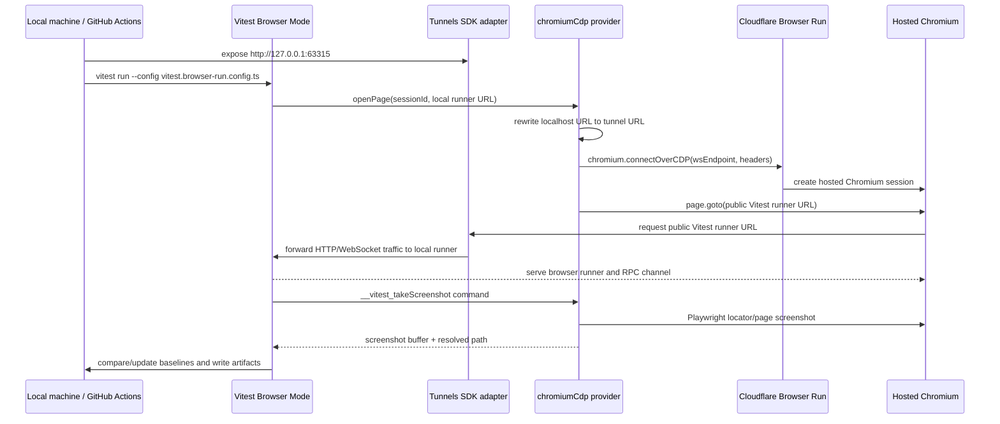

# Vitest Browser Run

This repo is a proof-of-concept for running Vitest Browser Mode tests on Cloudflare Browser Run through Browser Run's Chrome DevTools Protocol endpoint.

The demo focuses on visual regression testing:

- Vitest owns test discovery, test execution, `expect.element(...).toMatchScreenshot()`, baseline updates, and screenshot comparison.
- Cloudflare Browser Run supplies hosted Chromium sessions over a standard CDP WebSocket.
- The custom provider in `test/browser-run-provider.ts` is the glue between those two systems.

The Worker application itself does not call Browser Run. Browser Run is only used as the browser infrastructure for Vitest Browser Mode.

## Mechanical Overview



The key detail is that the browser is remote but the Vitest browser runner is local. The remote browser cannot open `localhost`, so the runner is exposed through a short-lived tunnel and the provider rewrites Vitest's local runner URL to that public origin.

## Main Files

- `vitest.browser-run.config.ts` configures Vitest Browser Mode for Browser Run.
- `test/browser-run-provider.ts` implements the custom Vitest browser provider.
- `scripts/run-browser-run-visual.mjs` uses a Tunnels SDK-shaped quick tunnel adapter when needed and runs the visual suite.
- `vendor/tunnels-sdk/expose.mjs` preserves the `expose(port)` / `close()` surface from `dmmulroy/tunnels-sdk` while the upstream package is not directly consumable from npm.
- `.github/workflows/browser-run-visual.yml` runs the visual suite in CI without installing local Playwright browsers.
- `test/browser/visual-*.browser.test.ts` contains the visual regression tests.
- `test/browser/__screenshots__/**` contains committed Vitest screenshot baselines.

## Provider Shape

`test/browser-run-provider.ts` intentionally has two layers.

`chromiumCdp()` is the generic layer:

```ts
chromiumCdp({
  connect: async ({ sessionId, parallel }) => ({
    wsEndpoint: 'wss://example.com/devtools/browser',
    headers: { Authorization: 'Bearer ...' },
  }),
  publicOrigin: 'https://example-tunnel.trycloudflare.com',
})
```

That layer knows how to satisfy Vitest's provider contract using Playwright's CDP client:

- `openPage(sessionId, url, options)` creates or reuses a browser for the Vitest session.
- `close()` closes pages, contexts, and CDP browser connections.
- `getCDPSession(sessionId)` returns the CDP bridge Vitest expects.
- `getCommandsContext(sessionId)` returns the Playwright `page`, `context`, `frame`, and `iframe` handles used by provider commands.
- `__vitest_takeScreenshot` is registered so Vitest's native screenshot matcher can ask Playwright for a screenshot.
- `__vitest_viewport` is registered so `page.viewport(width, height)` works in the tests.

`browserRunCdp()` is the Cloudflare-specific wrapper. It builds the Browser Run CDP endpoint and authorization header:

```txt
wss://api.cloudflare.com/client/v4/accounts/<ACCOUNT_ID>/browser-rendering/devtools/browser?keep_alive=600000
Authorization: Bearer <API_TOKEN>
```

If `CF_BROWSER_RUN_RECORDING=true`, the wrapper appends `recording=true` to the CDP URL. Browser Run recordings are available after the browser session closes.

Because these are normal Browser Run CDP sessions, active sessions can also be inspected with Browser Run Live View from the Cloudflare dashboard. This repo does not fetch or print Live View URLs programmatically.

There is no `browser` binding in `wrangler.jsonc` because this demo does not launch Browser Run from inside a deployed Worker. It connects from Node.js/Vitest to Browser Run's CDP WebSocket, matching Cloudflare's CDP docs for external clients.

## Why A Provider Is Needed

Browser Run exposes a standard Chromium CDP WebSocket. Vitest Browser Mode, however, needs more than a WebSocket URL.

The provider has to:

- Connect Playwright with `chromium.connectOverCDP()`. Vitest's Playwright provider `connectOptions` path uses Playwright protocol, not raw CDP.
- Open the Vitest browser runner page for each Vitest browser session.
- Rewrite local runner URLs like `http://localhost:63315/__vitest_test__/?sessionId=...` to the public tunnel origin.
- Maintain page/context/browser lifecycle for parallel Vitest sessions.
- Register Vitest browser commands used by the tests and matchers.
- Return screenshot buffers and paths to Vitest so Vitest still owns baseline matching.

That is why this is implemented at the provider layer rather than inside the Worker app or inside `@vitest/browser` itself.

## Running Locally

Install dependencies:

```sh
npm ci
```

Run the normal Worker tests:

```sh
npm test
```

Set Browser Run credentials in the environment or in `.env`:

```sh
CF_ACCOUNT_ID="<account-id>"
CF_API_TOKEN="<token-with-browser-rendering-edit>"
```

`.env` is ignored by git via `.gitignore` and is loaded by `vitest.browser-run.config.ts` and `scripts/run-browser-run-visual.mjs` for local development. The ignore rule also covers `.env.local` and environment-specific `.env.*` files, while still allowing a future `.env.example` to be committed.

Run the Browser Run visual suite with an automatic quick tunnel:

```sh
npm run ci:browser-run:visual
```

Update visual baselines:

```sh
npm run ci:browser-run:visual -- --update
```

If you already have a public origin for the Vitest browser runner, set it and use the lower-level scripts directly:

```sh
export VITEST_BROWSER_PUBLIC_ORIGIN="https://<your-public-origin>"
npm run test:browser-run:visual
npm run test:browser-run:visual:update
```

The helper imports `vendor/tunnels-sdk/expose.mjs` and calls:

```js
const tunnel = await expose(63315)
```

That adapter follows the `dmmulroy/tunnels-sdk` quick tunnel shape and uses `cloudflared` internally. It downloads a pinned `cloudflared` binary to `node_modules/.cache/tunnels/bin` when one is not provided, starts a quick tunnel for `http://127.0.0.1:63315`, waits for a `trycloudflare.com` URL and a registered tunnel connection, then closes the tunnel after Vitest exits.

The adapter is vendored because the SDK package is currently in the `packages/tunnels` workspace of `dmmulroy/tunnels-sdk`, while npm git dependencies install the repository root package (`tunnels-monorepo`) rather than that workspace package. The public `tunnels` package name on npm is an unrelated package, and likely scoped names such as `@dmmulroy/tunnels` are not published. Once the SDK publishes the workspace package or provides a consumable tarball, this file should be replaced with a normal dependency and `import { expose } from '...'`.

Cloudflare quick tunnels intentionally create random `*.trycloudflare.com` hostnames. They are suitable for short-lived CI and demos; use `VITEST_BROWSER_PUBLIC_ORIGIN` if you want to provide a different public runner origin.

## Visual Regression Flow

The visual tests render deterministic DOM fixtures from `test/browser/visual-stories.ts`. They use Vitest's native Browser Mode matcher:

```ts
const root = document.querySelector<HTMLElement>('[data-testid="visual-root"]')
await expect.element(root!).toMatchScreenshot('dashboard/desktop')
```

Vitest handles:

- reference screenshots in `test/browser/__screenshots__/**`
- `--update` baseline writes
- `pixelmatch` comparison
- missing-baseline failures
- actual/diff/reference artifacts under `.vitest-attachments` when comparisons fail

The provider's screenshot command does not implement image diffing. It only takes the screenshot through Playwright and returns the buffer to Vitest.

Committed baselines are platform-specific because Vitest includes the browser and host platform in the default path, for example:

```txt
test/browser/__screenshots__/visual-dashboard.browser.test.ts/dashboard/desktop-chromium-darwin.png
```

## Parallel Browser Run Sessions

`vitest.browser-run.config.ts` enables browser file parallelism and sets `maxWorkers` from `CF_BROWSER_RUN_CONCURRENCY` or `VITEST_MAX_WORKERS`. The default is `4`.

The provider reports `supportsParallelism = true`. With the default `CF_BROWSER_RUN_BROWSER_PER_SESSION=true`, each parallel Vitest browser session gets its own Browser Run CDP browser connection. That is the hosted-browser fan-out this repo is meant to demonstrate.

The provider also staggers CDP connection attempts with `CF_BROWSER_RUN_LAUNCH_DELAY_MS`, defaulting to `1100`, retries transient Browser Run startup failures like `410 Gone` / `state: unhealthy`, and retries transient tunnel navigation failures like `ERR_CONNECTION_RESET` and `ERR_CONNECTION_REFUSED`.

Run a simple concurrency comparison:

```sh
BROWSER_RUN_BENCHMARK_CONCURRENCY=1,4 npm run benchmark:browser-run
```

## Configuration

Required for Browser Run:

- `CF_ACCOUNT_ID` or `CLOUDFLARE_ACCOUNT_ID`
- `CF_API_TOKEN` or `CLOUDFLARE_API_TOKEN`

Optional:

- `VITEST_BROWSER_PUBLIC_ORIGIN` skips automatic quick tunnel startup and uses the provided public runner origin.
- `VITEST_BROWSER_API_PORT` changes the local Vitest browser runner port. The default is `63315`.
- `VITEST_BROWSER_API_HOST` changes the local Vitest browser runner host. The default is `0.0.0.0`.
- `TUNNELS_SDK_CLOUDFLARED_PATH` makes the Tunnels SDK adapter use an existing `cloudflared` binary instead of downloading one.
- `TUNNELS_SDK_CLOUDFLARED_VERSION` overrides the adapter's pinned `cloudflared` release. The default matches the upstream SDK adapter at `2025.2.0`.
- `CF_BROWSER_RUN_WS_ENDPOINT` bypasses Browser Run URL construction and uses a complete CDP WebSocket URL.
- `CF_BROWSER_RUN_KEEP_ALIVE_MS` controls the Browser Run `keep_alive` query parameter. The default is `600000`.
- `CF_BROWSER_RUN_RECORDING=true` appends `recording=true` so Browser Run records the session.
- `CF_BROWSER_RUN_CONCURRENCY` controls Vitest worker count for Browser Run visual tests. The default is `4`.
- `CF_BROWSER_RUN_BROWSER_PER_SESSION=false` allows non-parallel runs to reuse a single CDP browser connection.
- `CF_BROWSER_RUN_LAUNCH_DELAY_MS` staggers CDP browser connection attempts. The default is `1100`.
- `CF_BROWSER_RUN_LOG_SESSIONS=false` disables provider session logs.

The base Vitest config intentionally keeps this simple:

```ts
provider: browserRunCdp()
```

`browserRunCdp()` reads the Browser Run env vars above and applies defaults internally. Pass explicit options only when a config file needs to override environment-driven behavior.

## CI

`.github/workflows/browser-run-visual.yml` runs on pull requests, pushes to `main`, and manual dispatches.

The workflow:

- installs Node dependencies with `npm ci`
- intentionally does not install local Playwright browsers
- lets the Tunnels SDK adapter resolve `cloudflared` for the short-lived public runner URL
- runs `npm run ci:browser-run:visual`
- uploads `test/browser/**/__screenshots__/**` and `.vitest-attachments/**`

The workflow expects these GitHub secrets:

- `CF_ACCOUNT_ID`
- `CF_API_TOKEN`

The manual `benchmark` job runs `npm run benchmark:browser-run` with `BROWSER_RUN_BENCHMARK_CONCURRENCY=1,4`.

## Upstream Shape

The generic integration point is not Cloudflare-specific. A reusable version would likely be either:

- a generic `@vitest/browser-cdp` provider that accepts `{ wsEndpoint, headers }` or a `connect()` callback
- a `connectOverCDPOptions` branch in `@vitest/browser-playwright`

Browser Run would then be a very small wrapper that converts Cloudflare account/token/options into a CDP endpoint and headers.
