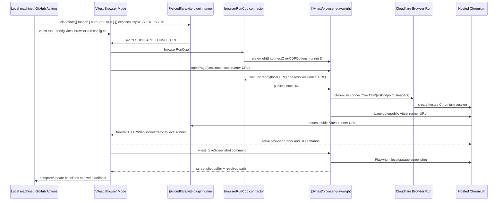

# Vitest Browser Run

This repo is a proof-of-concept for running Vitest Browser Mode tests on Cloudflare Browser Run through Browser Run's Chrome DevTools Protocol endpoint.

The demo focuses on visual regression testing:

- Vitest owns test discovery, test execution, `expect.element(...).toMatchScreenshot()`, baseline updates, and screenshot comparison.
- `@vitest/browser-playwright` owns the Vitest Browser Mode provider lifecycle, commands, tracing, mocking, and Playwright integration.
- Cloudflare Browser Run supplies hosted Chromium sessions over a standard CDP WebSocket.
- The package in `packages/browser-run-provider` is now only the Cloudflare Browser Run connector around that Playwright provider.

This proof depends on two pending upstream PRs:

- Vitest: https://github.com/irvinebroque/vitest/pull/1
- Workers SDK: https://github.com/irvinebroque/workers-sdk/pull/9

## Mechanical Overview



The key detail is that the browser is remote but the Vitest browser runner is local. The remote browser cannot open `localhost`, so the runner is exposed through a short-lived tunnel and the connector uses the Playwright provider's runner hook to rewrite Vitest's local runner URL to that public origin.

## Connector Shape

`@cloudflare/vitest-browser-run-provider` is intentionally small. It does not implement a generic Vitest Browser Mode provider anymore.

There are three layers:

- `@vitest/browser-playwright` is the upstream provider layer.
- `browserRunCdp()` is the Cloudflare Browser Run connector around that provider.
- `@cloudflare/vite-plugin` owns tunnel startup and publishes the public runner URL into `CLOUDFLARE_TUNNEL_URL`.

`browserRunCdp()` builds the Browser Run CDP endpoint and authorization header, configures the public runner URL hooks, and delegates to the Playwright provider:

```ts
browserRunCdp({
	accountId,
	apiToken,
	keepAliveMs: 600000,
	recording: true,
	publicOrigin: 'https://runner.example.com',
})
```

Internally that becomes:

```ts
playwright({
	connectOverCDPOptions: {
		wsEndpoint,
		headers: { Authorization: `Bearer ${apiToken}` },
	},
	runner: {
		resolveUrl: ({ url }) => resolveBrowserRunRunnerUrl(url, publicOrigin),
		waitForReady: ({ url }) => waitForBrowserRunRunnerReady(url, options),
	},
	contextStrategy: 'reuse-default-on-failure',
})
```

The default Browser Run CDP URL is:

```txt
wss://api.cloudflare.com/client/v4/accounts/<ACCOUNT_ID>/browser-rendering/devtools/browser?keep_alive=600000
Authorization: Bearer <API_TOKEN>
```

If `CF_BROWSER_RUN_RECORDING=true`, the wrapper appends `recording=true` to the CDP URL. Browser Run recordings are available after the browser session closes.

## Supported Surface

Supported today:

- Chromium CDP sessions through `@vitest/browser-playwright`'s `connectOverCDPOptions` path.
- Vitest Browser Mode page/context/session lifecycle from the Playwright provider.
- Screenshot, viewport, user-event, tracing, and browser module mocking behavior from the Playwright provider.
- Browser Run endpoint construction, auth headers, keep-alive, and recording options.
- Local runner URL rewriting through `browserRunCdp()` and quick tunnel startup through `@cloudflare/vite-plugin`.

Known proof constraints:

- Only Chromium can use `connectOverCDPOptions`.
- The workspace currently depends on the local Vitest fork that contains `connectOverCDPOptions`, `runner.resolveUrl`, `runner.waitForReady`, `contextStrategy`, Browser RPC WebSocket markers, and third-party Vite environment handling.
- The workspace currently depends on the local Workers SDK fork that contains `@cloudflare/vite-plugin` default `CLOUDFLARE_TUNNEL_URL` publication, `tunnel.env`, and `tunnel.onReady`.
- The Browser Run connector does not implement custom Browser Run launch staggering, per-session browser fan-out, or connection retry classification in this Playwright-backed proof shape.

## Running Locally

This branch needs sibling checkouts of both pending upstream PRs before `pnpm install` will work in this repo.

Set up the Vitest fork:

```sh
cd ..
git clone https://github.com/irvinebroque/vitest.git vitest
cd vitest
git switch feat/playwright-cdp-options
pnpm install
pnpm build
cd ../vitest-browser-run
```

Set up the Workers SDK fork:

```sh
cd ..
git clone --branch vite-tunnel-programmatic-url --single-branch https://github.com/irvinebroque/workers-sdk.git workers-sdk-vite-tunnel-programmatic-url
cd workers-sdk-vite-tunnel-programmatic-url
pnpm install --frozen-lockfile
pnpm --filter @cloudflare/vite-plugin... build
cd ../vitest-browser-run
```

Then install this repo's dependencies:

```sh
pnpm install
```

The important paths are relative to this repository:

- `../vitest/packages/vitest`
- `../vitest/packages/browser`
- `../vitest/packages/browser-playwright`
- `../workers-sdk-vite-tunnel-programmatic-url/packages/vite-plugin-cloudflare`

Run the Browser Run connector tests:

```sh
pnpm test
```

Run the normal Worker tests:

```sh
pnpm test:worker
```

At the time of this proof, `@cloudflare/vitest-pool-workers` supports Vitest `^4.1.0`, so `pnpm test:worker` is not expected to pass while this workspace is linked to the Vitest 5 beta fork.

Set Browser Run credentials in the environment or in `.env`:

```sh
CLOUDFLARE_ACCOUNT_ID="<account-id>"
CLOUDFLARE_API_TOKEN="<token-with-browser-rendering-edit>"
```

`CLOUDFLARE_API_TOKEN` must have Browser Rendering - Edit permission. `.env` is ignored by git via `.gitignore` and is loaded by `vitest.browser-run.config.ts` for local development. The committed `.env.example` shows the expected keys without storing real secrets.

Run the Browser Run visual suite with an automatic quick tunnel:

```sh
pnpm test:browser-run:visual
```

Update visual baselines:

```sh
pnpm test:browser-run:visual:update
```

If you already have a public origin for the Vitest browser runner, set it and run the same scripts. `browserRunCdp()` will use it as the runner origin:

```sh
export CLOUDFLARE_TUNNEL_URL="https://<your-public-origin>"
pnpm test:browser-run:visual
pnpm test:browser-run:visual:update
```

The Vitest config starts the tunnel and configures the provider:

```ts
plugins: [cloudflare({
  tunnel: {
    autoStart: true,
  },
})],
test: {
  browser: {
    provider: browserRunCdp(),
  },
}
```

## Configuration

Required for Browser Run:

- `CLOUDFLARE_ACCOUNT_ID`
- `CLOUDFLARE_API_TOKEN` with Browser Rendering - Edit permission

Optional:

- `CLOUDFLARE_TUNNEL_URL` uses the provided public runner origin. The example config still starts a tunnel because it sets `tunnel.autoStart: true`.
- `VITEST_BROWSER_PUBLIC_ORIGIN` overrides the public runner origin for Browser Run without affecting the Cloudflare Vite plugin tunnel.
- `VITEST_BROWSER_API_PORT` changes the local Vitest browser runner port. The default is `63315`.
- `VITEST_BROWSER_API_HOST` changes the local Vitest browser runner host. The default is `0.0.0.0`.
- `CF_BROWSER_RUN_WS_ENDPOINT` bypasses Browser Run URL construction and uses a complete CDP WebSocket URL.
- `CF_BROWSER_RUN_KEEP_ALIVE_MS` controls the Browser Run `keep_alive` query parameter. The default is `600000`.
- `CF_BROWSER_RUN_RECORDING=true` appends `recording=true` so Browser Run records the session.
- `CF_BROWSER_RUN_CONCURRENCY` controls Vitest worker count for Browser Run visual tests. The default is `4`.

The base Vitest config intentionally keeps this simple:

```ts
provider: browserRunCdp()
```

`browserRunCdp()` reads the Browser Run env vars above and applies defaults internally. Pass explicit options only when a config file needs to override environment-driven behavior.

Keep tokens out of committed Vitest config. If you need explicit options for a custom secret-loading path, read from your secret source and pass the values programmatically:

```ts
provider: browserRunCdp({
  accountId: process.env.CLOUDFLARE_ACCOUNT_ID,
  apiToken: process.env.CLOUDFLARE_API_TOKEN,
})
```

Legacy `CF_ACCOUNT_ID` and `CF_API_TOKEN` aliases are still supported, but new projects should use the canonical `CLOUDFLARE_*` names that Wrangler documents.

## CI

`.github/workflows/browser-run-visual.yml` runs on pull requests, pushes to `main`, and manual dispatches.

The local-link proof branch needs the Vitest and Workers SDK forks available before that workflow can run unchanged in CI. Once the upstream changes are published or vendored in CI, the workflow shape is:

The workflow:

- installs Node dependencies with `pnpm install --frozen-lockfile`
- intentionally does not install local Playwright browsers
- lets `@cloudflare/vite-plugin` start the tunnel and publish `CLOUDFLARE_TUNNEL_URL`
- runs `pnpm test:browser-run:visual`
- uploads `test/browser/**/__screenshots__/**` and `.vitest-attachments/**`

The workflow expects these GitHub secrets:

- `CLOUDFLARE_ACCOUNT_ID`
- `CLOUDFLARE_API_TOKEN`

The workflow also accepts legacy `CF_ACCOUNT_ID` and `CF_API_TOKEN` secrets as a fallback for existing CI setup.
