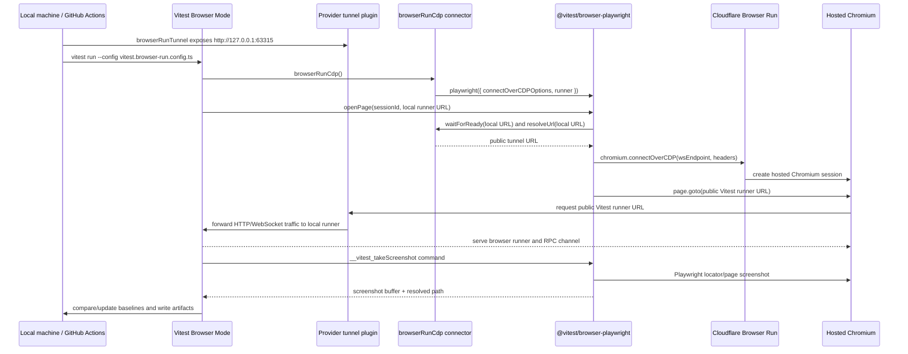

# Vitest Browser Run

This repo is a proof-of-concept for running Vitest Browser Mode tests on Cloudflare Browser Run through Browser Run's Chrome DevTools Protocol endpoint.

The demo focuses on visual regression testing:

- Vitest owns test discovery, test execution, `expect.element(...).toMatchScreenshot()`, baseline updates, and screenshot comparison.
- `@vitest/browser-playwright` owns the Vitest Browser Mode provider lifecycle, commands, tracing, mocking, and Playwright integration.
- Cloudflare Browser Run supplies hosted Chromium sessions over a standard CDP WebSocket.
- The package in `packages/browser-run-provider` is now only the Cloudflare Browser Run connector around that Playwright provider.

This proof is wired to `irvinebroque/vitest#1`, which adds a Chromium `connectOverCDPOptions` path plus runner URL hooks to `@vitest/browser-playwright`. Until that Vitest change is merged and published, this repo intentionally uses local `link:` dependencies to `../vitest`.

The Worker application itself does not call Browser Run. Browser Run is only used as the browser infrastructure for Vitest Browser Mode.

## Mechanical Overview



The key detail is that the browser is remote but the Vitest browser runner is local. The remote browser cannot open `localhost`, so the runner is exposed through a short-lived tunnel and the connector uses the Playwright provider's runner hook to rewrite Vitest's local runner URL to that public origin.

## Main Files

- `package.json` is the private example Worker package and workspace root.
- `pnpm-workspace.yaml` declares local packages under `packages/*`.
- `packages/browser-run-provider` is the reusable Browser Run connector package consumed by the example via `workspace:*`.
- `vitest.browser-run.config.ts` configures Vitest Browser Mode for Browser Run.
- `packages/browser-run-provider/src/browser-run.ts` adapts Cloudflare Browser Run credentials/options into `@vitest/browser-playwright` `connectOverCDPOptions` and runner callbacks.
- `packages/browser-run-provider/src/runner-origin.ts` provides reusable local-to-public runner URL helpers.
- `packages/browser-run-provider/src/vitest-plugin.ts` starts the quick tunnel from the Vitest config when `VITEST_BROWSER_PUBLIC_ORIGIN` is not already set.
- `packages/browser-run-provider/src/tunnel.ts` preserves the `expose(port)` / `close()` surface from `dmmulroy/tunnels-sdk` while the upstream package is not directly consumable from npm.
- `.github/workflows/browser-run-visual.yml` runs the visual suite in CI without installing local Playwright browsers.
- `test/browser/visual-*.browser.test.ts` contains the visual regression tests.
- `test/browser/__screenshots__/**` contains committed Vitest screenshot baselines.

## Provider Shape

`@vitest-browser-run/browser-run-provider` is intentionally small. It does not implement a generic Vitest Browser Mode provider anymore.

There are three layers:

- `@vitest/browser-playwright` is the upstream provider layer.
- `browserRunCdp()` is the Cloudflare Browser Run connector around that provider.
- `browserRunTunnel()` is an optional tunnel helper for local Vitest runner access.

`browserRunCdp()` builds the Browser Run CDP endpoint and authorization header, configures the public runner URL hooks, and delegates to the Playwright provider:

```ts
browserRunCdp({
	accountId,
	apiToken,
	keepAliveMs: 600000,
	recording: true,
	publicOrigin: 'https://runner.example.com',
})
```

Internally that becomes:

```ts
playwright({
	connectOverCDPOptions: {
		wsEndpoint,
		headers: { Authorization: `Bearer ${apiToken}` },
	},
	runner: {
		resolveUrl: ({ url }) => resolveBrowserRunRunnerUrl(url, publicOrigin),
		waitForReady: ({ url }) => waitForLocalBrowserRunner(url),
	},
	contextStrategy: 'reuse-default-on-failure',
})
```

The default Browser Run CDP URL is:

```txt
wss://api.cloudflare.com/client/v4/accounts/<ACCOUNT_ID>/browser-rendering/devtools/browser?keep_alive=600000
Authorization: Bearer <API_TOKEN>
```

If `CF_BROWSER_RUN_RECORDING=true`, the wrapper appends `recording=true` to the CDP URL. Browser Run recordings are available after the browser session closes.

Browser Run-specific behavior is intentionally limited to env var resolution, missing `VITEST_BROWSER_PUBLIC_ORIGIN` errors, endpoint construction, auth headers, keep-alive/recording defaults, and public runner URL rewriting. Generic Vitest provider behavior stays in `@vitest/browser-playwright`.

`browserRunCdp()` sets `contextStrategy: 'reuse-default-on-failure'` because some CDP endpoints expose a default browser context but do not allow Playwright to create a fresh context. The provider name reported to Vitest is still `playwright` because the upstream provider owns the provider implementation.

Because these are normal Browser Run CDP sessions, active sessions can also be inspected with Browser Run Live View from the Cloudflare dashboard. This repo does not fetch or print Live View URLs programmatically.

There is no `browser` binding in `wrangler.jsonc` because this demo does not launch Browser Run from inside a deployed Worker. It connects from Node.js/Vitest to Browser Run's CDP WebSocket, matching Cloudflare's CDP docs for external clients.

## Why A Provider Is Needed

Browser Run exposes a standard Chromium CDP WebSocket. Vitest Browser Mode, however, needs more than a WebSocket URL.

The provider layer has to:

- Connect Playwright with `chromium.connectOverCDP()`. Vitest's Playwright provider `connectOptions` path uses Playwright protocol, not raw CDP.
- Open the Vitest browser runner page for each Vitest browser session.
- Let connectors optionally rewrite local runner URLs like `http://localhost:63315/__vitest_test__/?sessionId=...` to a public tunnel origin.
- Maintain page/context/browser lifecycle for parallel Vitest sessions.
- Register Vitest browser commands used by the tests and matchers.
- Return screenshot buffers and paths to Vitest so Vitest still owns baseline matching.

The local Vitest fork proves those provider-layer capabilities belong in `@vitest/browser-playwright`. Browser Run only supplies `connectOverCDPOptions` and runner URL behavior.

## Why Not `@cloudflare/playwright`

Cloudflare's Browser Run Playwright package is designed for browser automation from Cloudflare Workers through a Browser Run binding. This repo runs in Node.js as a Vitest Browser Mode provider. The relevant Browser Run API for this path is the external CDP WebSocket endpoint, which Cloudflare documents as usable from a local machine, cloud environment, or Workers by CDP-compatible clients such as Playwright and Puppeteer.

That is why this package configures `@vitest/browser-playwright` with Browser Run's external CDP WebSocket instead of adding a Worker `browser` binding or launching through `@cloudflare/playwright`.

## Supported Surface

Supported today:

- Chromium CDP sessions through `@vitest/browser-playwright`'s `connectOverCDPOptions` path.
- Vitest Browser Mode page/context/session lifecycle from the Playwright provider.
- Screenshot, viewport, user-event, tracing, and browser module mocking behavior from the Playwright provider.
- Browser Run endpoint construction, auth headers, keep-alive, and recording options.
- Local runner URL rewriting through `browserRunCdp()` and optional quick tunnel startup through `browserRunTunnel()`.

Known proof constraints:

- Only Chromium can use `connectOverCDPOptions`.
- The workspace currently depends on the local Vitest fork that contains `connectOverCDPOptions`, `runner.resolveUrl`, `runner.waitForReady`, and `contextStrategy`.
- The Browser Run connector does not implement custom Browser Run launch staggering, per-session browser fan-out, or connection retry classification in this Playwright-backed proof shape.

## Running Locally

This branch needs a sibling checkout of the Vitest fork before `pnpm install` will work in this repo:

```sh
cd ..
git clone https://github.com/irvinebroque/vitest.git vitest
cd vitest
git switch feat/playwright-cdp-options
pnpm install
pnpm build
cd ../vitest-browser-run
```

Then install this repo's dependencies:

```sh
pnpm install
```

The important path is `../vitest` relative to this repository. The linked packages are `../vitest/packages/vitest`, `../vitest/packages/browser`, and `../vitest/packages/browser-playwright`.

Run the Browser Run connector tests:

```sh
pnpm test
```

Run the normal Worker tests:

```sh
pnpm test:worker
```

At the time of this proof, `@cloudflare/vitest-pool-workers` supports Vitest `^4.1.0`, so `pnpm test:worker` is not expected to pass while this workspace is linked to the Vitest 5 beta fork.

Set Browser Run credentials in the environment or in `.env`:

```sh
CF_ACCOUNT_ID="<account-id>"
CF_API_TOKEN="<token-with-browser-rendering-edit>"
```

`.env` is ignored by git via `.gitignore` and is loaded by `vitest.browser-run.config.ts` for local development. The ignore rule also covers `.env.local` and environment-specific `.env.*` files, while still allowing a future `.env.example` to be committed.

Run the Browser Run visual suite with an automatic quick tunnel:

```sh
pnpm test:browser-run:visual
```

Update visual baselines:

```sh
pnpm test:browser-run:visual:update
```

If you already have a public origin for the Vitest browser runner, set it and run the same scripts. The tunnel plugin will skip quick tunnel startup:

```sh
export VITEST_BROWSER_PUBLIC_ORIGIN="https://<your-public-origin>"
pnpm test:browser-run:visual
pnpm test:browser-run:visual:update
```

The Vitest config starts the tunnel and configures the provider:

```ts
plugins: [browserRunTunnel({ port: browserApiPort })],
test: {
  browser: {
    provider: browserRunCdp(),
  },
}
```

The tunnel adapter follows the `dmmulroy/tunnels-sdk` quick tunnel shape and uses `cloudflared` internally. It downloads a pinned `cloudflared` binary to `node_modules/.cache/tunnels/bin` when one is not provided, starts a quick tunnel for `http://127.0.0.1:63315`, waits for a `trycloudflare.com` URL and a registered tunnel connection, then closes the tunnel when the Vitest server shuts down.

The adapter is vendored because the SDK package is currently in the `packages/tunnels` workspace of `dmmulroy/tunnels-sdk`, while npm git dependencies install the repository root package (`tunnels-monorepo`) rather than that workspace package. The public `tunnels` package name on npm is an unrelated package, and likely scoped names such as `@dmmulroy/tunnels` are not published. Once the SDK publishes the workspace package or provides a consumable tarball, this file should be replaced with a normal dependency and `import { expose } from '...'`.

Cloudflare quick tunnels intentionally create random `*.trycloudflare.com` hostnames. They are suitable for short-lived CI and demos; use `VITEST_BROWSER_PUBLIC_ORIGIN` if you want to provide a different public runner origin.

## Visual Regression Flow

The visual tests render deterministic DOM fixtures from `test/browser/visual-stories.ts`. They use Vitest's native Browser Mode matcher:

```ts
const root = document.querySelector<HTMLElement>('[data-testid="visual-root"]')
await expect.element(root!).toMatchScreenshot('dashboard/desktop')
```

Vitest handles:

- reference screenshots in `test/browser/__screenshots__/**`
- `--update` baseline writes
- `pixelmatch` comparison
- missing-baseline failures
- actual/diff/reference artifacts under `.vitest-attachments` when comparisons fail

The Playwright provider's screenshot command does not implement image diffing. It only takes the screenshot through Playwright and returns the buffer to Vitest.

Committed baselines are platform-specific because Vitest includes the browser and host platform in the default path, for example:

```txt
test/browser/__screenshots__/visual-dashboard.browser.test.ts/dashboard/desktop-chromium-darwin.png
```

## Parallel Browser Run Sessions

`vitest.browser-run.config.ts` enables browser file parallelism and sets `maxWorkers` from `CF_BROWSER_RUN_CONCURRENCY` or `VITEST_MAX_WORKERS`. The default is `4`.

The Playwright provider reports `supportsParallelism = true`. In this proof shape, `@vitest/browser-playwright` owns connection, context, page, and command lifecycle; `browserRunCdp()` only configures the Browser Run CDP endpoint and runner URL hooks.

`browserRunCdp()` sets `contextStrategy: 'reuse-default-on-failure'` so the Playwright provider can fall back to an existing default context if the CDP endpoint does not allow creating a new context.

## Configuration

Required for Browser Run:

- `CF_ACCOUNT_ID` or `CLOUDFLARE_ACCOUNT_ID`
- `CF_API_TOKEN` or `CLOUDFLARE_API_TOKEN`

Optional:

- `VITEST_BROWSER_PUBLIC_ORIGIN` skips automatic quick tunnel startup and uses the provided public runner origin.
- `VITEST_BROWSER_API_PORT` changes the local Vitest browser runner port. The default is `63315`.
- `VITEST_BROWSER_API_HOST` changes the local Vitest browser runner host. The default is `0.0.0.0`.
- `TUNNELS_SDK_CLOUDFLARED_PATH` makes the tunnel adapter use an existing `cloudflared` binary instead of downloading one.
- `TUNNELS_SDK_CLOUDFLARED_VERSION` overrides the adapter's pinned `cloudflared` release. The default matches the upstream SDK adapter at `2025.2.0`.
- `CF_BROWSER_RUN_WS_ENDPOINT` bypasses Browser Run URL construction and uses a complete CDP WebSocket URL.
- `CF_BROWSER_RUN_KEEP_ALIVE_MS` controls the Browser Run `keep_alive` query parameter. The default is `600000`.
- `CF_BROWSER_RUN_RECORDING=true` appends `recording=true` so Browser Run records the session.
- `CF_BROWSER_RUN_CONCURRENCY` controls Vitest worker count for Browser Run visual tests. The default is `4`.

The base Vitest config intentionally keeps this simple:

```ts
provider: browserRunCdp()
```

`browserRunCdp()` reads the Browser Run env vars above and applies defaults internally. Pass explicit options only when a config file needs to override environment-driven behavior.

## CI

`.github/workflows/browser-run-visual.yml` runs on pull requests, pushes to `main`, and manual dispatches.

The local-link proof branch needs the Vitest fork available before that workflow can run unchanged in CI. Once the Playwright CDP changes are published or vendored in CI, the workflow shape is:

The workflow:

- installs Node dependencies with `pnpm install --frozen-lockfile`
- intentionally does not install local Playwright browsers
- lets the provider tunnel adapter resolve `cloudflared` for the short-lived public runner URL
- runs `pnpm test:browser-run:visual`
- uploads `test/browser/**/__screenshots__/**` and `.vitest-attachments/**`

The workflow expects these GitHub secrets:

- `CF_ACCOUNT_ID`
- `CF_API_TOKEN`

## Upstreaming Notes

This repo now proves the upstream `@vitest/browser-playwright` path instead of carrying a separate generic CDP provider.

The Vitest fork adds:

- `connectOverCDPOptions` for Chromium CDP endpoints.
- `runner.resolveUrl` and `runner.waitForReady` hooks for remote browsers that cannot reach the local Vitest runner URL directly.
- `contextStrategy: 'reuse-default-on-failure'` for CDP services that expose a default context but reject `browser.newContext()`.

The Browser Run package then remains a small connector that converts Cloudflare account/token/options into CDP connect options and runner URL behavior. The earlier custom `browserCdp()` provider and mirrored command modules were removed from this proof branch to avoid drift from Vitest's Playwright provider.

The tunnel helper is still local to this package. A cleaner upstream shape would be for `@cloudflare/vite-plugin` to expose the tunnel URL programmatically so `browserRunTunnel()` and the vendored tunnel adapter can be removed.
